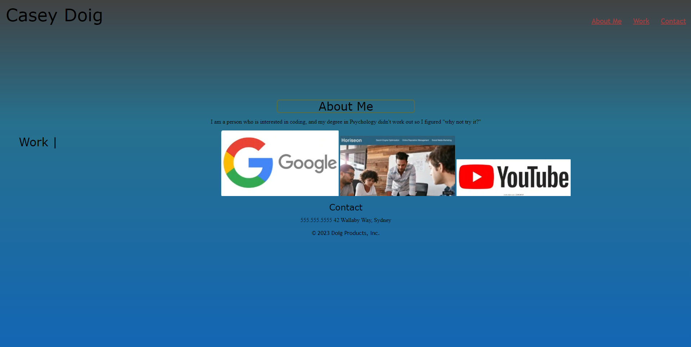

# My Portfolio Playground, for what it is 
<!-- added spaces, got rid of second set of # -->
With this assignment, we were tasked with using the html and css knowledge that we have acquired within the first week to week and a half of class to make a portfolio that we might use for employment in the future. I made one such portfolio, and I certainly don't plan on using it for employment as I knokw it looks pretty unsavory, but it's my portfolio regardless. 

## The knowledge within 
<!-- added spaces, got rid of second set of # -->
Part of the main goal in this assignment is to show that we can at least fool around with linking images to websites and showing that we can utilize flexboxes to a beginner-degree. I believe that I fulfilled that requirement, with some definite struggles along the way.

## Improvements in the future 
<!-- added spaces, got rid of second set of # -->
This assignment proved to me that I need to practice a lot more as I went along. There is a lot of vocabulary to get down in the coding world, and while Google is a wonderful search engine, alongside w3schools in order to help me complete this, I have much to improve upon. One such thing would be getting proper shadow properties on my objects within the page. Though it seems trivial, these are little things that an employer might pick up on that show I know how to use a lot of accessories within the coding world.
<!-- added screenshot to readme -->
